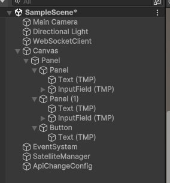
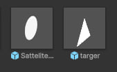

<h2>Звіт по лабораторній роботі: Розробка додатку для візуалізації вимірювань GPS</h2>

<h3>Мета роботи</h3>
<p>Метою даної лабораторної роботи є розробка додатку, який зчитує дані з емульованої вимірювальної частини GPS, наданої у вигляді Docker image, та відображає положення об'єкта і супутників на графіку в декартових координатах.</p>

<h3>Теоретичні відомості</h3>
<p><strong>Трилатерація</strong> — це метод визначення положення об'єкта у просторі на основі відстані до кількох точок з відомими координатами. Цей метод активно використовується в GPS для обчислення місцезнаходження.</p>
<p>Для розрахунку положення об'єкта використовується система рівнянь, яка описує кола (у 2D) або сфери (у 3D) навколо відомих точок. Положення об'єкта визначається в точці перетину цих кіл або сфер.</p>

<h3>Методика розв'язання</h3>
<p>В лабораторній роботі використовуються три точки з відомими координатами та відстані до шуканого об'єкта:</p>
<ul>
  <li>Точки: A(x<sub>1</sub>, y<sub>1</sub>), B(x<sub>2</sub>, y<sub>2</sub>), C(x<sub>3</sub>, y<sub>3</sub>).</li>
  <li>Відстані: r<sub>1</sub>, r<sub>2</sub>, r<sub>3</sub>.</li>
</ul>
<p>Рівняння кіл для цих точок мають вигляд:</p>
<ul>
  <li>(x - x<sub>1</sub>)² + (y - y<sub>1</sub>)² = r<sub>1</sub>²</li>
  <li>(x - x<sub>2</sub>)² + (y - y<sub>2</sub>)² = r<sub>2</sub>²</li>
  <li>(x - x<sub>3</sub>)² + (y - y<sub>3</sub>)² = r<sub>3</sub>²</li>
</ul>

<h3>Розробка додатку</h3>
<p>1. Завантаження Docker-образу GPS-емулятора за допомогою команди:</p>
<pre><code>docker pull your-gps-emulator-image</code></pre>
<p>2. Запуск контейнера для емуляції даних GPS:</p>
<pre><code>docker run --name gps-emulator -p 4000:4000 your-gps-emulator-image</code></pre>
<p>3. Отримання даних через WebSocket та використання бібліотеки для візуалізації координат об'єкта і супутників.</p>

<h3>Результат</h3>
<h3>Розробка додатку</h3>

<p>Для реалізації взаємодії з GPS-емулятором був розроблений WebSocket-клієнт на Unity. Цей код підключається до WebSocket-сервера, отримує дані про координати об'єкта в реальному часі та відправляє їх на обробку для подальшої візуалізації. Клієнт обробляє повідомлення, що приходять у форматі JSON, і передає їх для відображення супутникових координат у додатку.</p>

<p>Клієнт включає наступні основні функції:</p>
<ul>
    <li>Підключення до WebSocket сервера через порт 4001;</li>
    <li>Обробка підключення, помилок і закриття з'єднання;</li>
    <li>Отримання повідомлень з даними GPS у форматі JSON;</li>
    <li>Передача даних для подальшої обробки й візуалізації у додатку;</li>
</ul>

<p>Нижче наведений код для підключення та обробки даних:</p>

```csharp
using System;
using System.Text;
using System.Threading.Tasks;
using UnityEngine;
using NativeWebSocket;

public class WebSocketClient : MonoBehaviour
{
    private WebSocket websocket;

    async void Start()
    {
        websocket = new WebSocket("ws://localhost:4001");

        websocket.OnOpen += () => {  Debug.Log("Соединение установлено!"); };
        websocket.OnError += (e) => { Debug.LogError("Ошибка: " + e); };
        websocket.OnClose += (e) => { Debug.Log("Соединение закрыто!");};
        websocket.OnMessage += (bytes) => {
            var message = Encoding.UTF8.GetString(bytes);
            ProcessGpsMessage(message);
        };

        await websocket.Connect();
    }

    void Update()
    {
#if !UNITY_WEBGL || UNITY_EDITOR
        websocket?.DispatchMessageQueue();
#endif
    }

    async void OnApplicationQuit()
    {
        await websocket.Close();
    }

    private void ProcessGpsMessage(string message)
    {
        GpsMessage gpsMessage = JsonUtility.FromJson<GpsMessage>(message);
        Debug.Log($"ID: {gpsMessage.id}, X: {gpsMessage.x}, Y: {gpsMessage.y}, SentAt: {gpsMessage.sentAt}, ReceivedAt: {gpsMessage.receivedAt}");

        SatelliteManager.Instance.UpdateSatellitePosition(gpsMessage.id, gpsMessage.x, gpsMessage.y, gpsMessage.sentAt, gpsMessage.receivedAt);
    }
}


[Serializable]
public class GpsMessage
{
    public string id;
    public float x;
    public float y;
    public double sentAt;
    public double receivedAt;
}
```

<p>Клас <code>GraphDrawer</code> відповідає за візуалізацію графіка в Unity. Він створює сітку з ліній у декартових координатах, відображаючи координати об'єктів, отриманих з GPS-даних. Основні функції класу:</p>
<ul>
    <li>Інстанціює префаби для ліній та тексту;</li>
    <li>Використовує метод <code>DrawGraph</code> для побудови графіка;</li>
    <li>Встановлює позиції ліній і відповідних текстів, відображаючи координати.</li>
</ul>
<p>Нижче наведено код класу:</p>

```csharp
using UnityEngine;
using TMPro;

public class GraphDrawer : MonoBehaviour
{
    public GameObject linePrefab; 
    public GameObject textPrefab; 
    public int numberOfLines = 10;
    public float spacing = 2f;

    void Start()
    {
        DrawGraph();
    }

    void DrawGraph()
    {
        for (int i = 0; i < numberOfLines; i++)
        {
            if (i == 0) { continue; }
            Vector3 linePosition = new Vector3(i * spacing, 0, 0);
            GameObject line = Instantiate(linePrefab, linePosition, Quaternion.Euler(90f, 0f, 0f));
            line.transform.localScale = new Vector3(1f, 1f, 5f); 
            GameObject text = Instantiate(textPrefab, linePosition + new Vector3(0, 0.5f, 0.5f), Quaternion.Euler(90f, 0f, 0f)); 
            TextMeshPro textMeshPro = text.GetComponent<TextMeshPro>();
            textMeshPro.text = linePosition.x.ToString("F0"); 
            textMeshPro.alignment = TextAlignmentOptions.Center; 
        }

        for (int i = 0; i < numberOfLines; i++)
        {
            if (i == 0) { continue; }
            Vector3 linePosition = new Vector3(0, 0, i * spacing);
            GameObject line = Instantiate(linePrefab, linePosition, Quaternion.Euler(90f, 0f, 0f)); 
            line.transform.localScale = new Vector3(1f, 1f, 5f); 
            GameObject text = Instantiate(textPrefab, linePosition + new Vector3(-0.5f, 0f, 0f), Quaternion.Euler(90f, 0f, 0f));
            TextMeshPro textMeshPro = text.GetComponent<TextMeshPro>();
            textMeshPro.text = linePosition.z.ToString("F0"); 
            textMeshPro.alignment = TextAlignmentOptions.Center;
        }
    }
}
```

<p>Клас <code>MoveAndScale</code> відповідає за управління камерою в Unity. Він дозволяє користувачу переміщати камеру та змінювати її масштаб за допомогою клавіш та прокрутки миші. Основні функції класу:</p>
<ul>
    <li>Переміщення камери в горизонтальному та вертикальному напрямках;</li>
    <li>Зміна розміру (масштабу) камери за допомогою прокрутки миші;</li>
    <li>Обмеження масштабу в межах визначених значень.</li>
</ul>
<p>Нижче наведено код класу:</p>

```csharp
using UnityEngine;

public class MoveAndScale : MonoBehaviour
{
    public float moveSpeed = 5f;
    private float minSize = 1f;
    private float maxSize = 50f;

    private Camera camera;

    void Start()
    {
        camera = GetComponent<Camera>(); 
    }

    void Update()
    {
        float moveX = Input.GetAxis("Horizontal") * moveSpeed * Time.deltaTime; 
        float moveZ = Input.GetAxis("Vertical") * moveSpeed * Time.deltaTime;
        transform.position += new Vector3(moveX, 0, moveZ);

        float scroll = Input.GetAxis("Mouse ScrollWheel");
        if (scroll != 0)
        {
            camera.orthographicSize = Mathf.Clamp(camera.orthographicSize - scroll * 5, minSize, maxSize);
        }
    }
}
```


<p>Клас <code>SatelliteManager</code> відповідає за управління супутниками в Unity. Він створює та оновлює позиції супутників, а також відображає цільовий об'єкт на сцені. Основні функції класу:</p>
<ul>
    <li>Створення супутників з унікальними кольорами;</li>
    <li>Оновлення позицій супутників на основі отриманих даних;</li>
    <li>Визначення позиції цільового об'єкта на основі координат супутників;</li>
    <li>Видалення старих супутників, які не були оновлені протягом певного часу.</li>
</ul>
<p>Нижче наведено код класу:</p>

```csharp
using System.Collections.Generic;
using UnityEngine;

public class SatelliteManager : MonoBehaviour
{
    public static SatelliteManager Instance;
    public GameObject satellitePrefab;
    public GameObject targetObjectPrefab;
    public float worldSize = 200f;
    public Color[] satelliteColors;
    public Color targetColor = Color.magenta;

    private float halfSize;
    private Dictionary<string, (GameObject satellite, float lastUpdateTime, Color color, double distance)> satellites = new Dictionary<string, (GameObject, float, Color, double)>();
    private List<Color> availableColors;
    private GameObject targetObject;
    private float maxUpdateTime = 5.0f;

    private void Awake()
    {
        if (Instance == null)
        {
            Instance = this;
        }
        else
        {
            Destroy(gameObject);
        }
    }

    void Start()
    {
        halfSize = worldSize / 2f;
        availableColors = new List<Color>(satelliteColors);
        DrawAxes();
        CreateTargetObject();
    }

    void DrawAxes()
    {
        DrawLine(new Vector3(-halfSize, 0, 0), new Vector3(halfSize, 0, 0), Color.red);
        DrawLine(new Vector3(0, 0, -halfSize), new Vector3(0, 0, halfSize), Color.green);
    }

    void DrawLine(Vector3 start, Vector3 end, Color color)
    {
        GameObject line = new GameObject("Line");
        LineRenderer lr = line.AddComponent<LineRenderer>();
        lr.startWidth = 0.1f;
        lr.endWidth = 0.1f;
        lr.material = new Material(Shader.Find("Sprites/Default"));
        lr.startColor = color;
        lr.endColor = color;
        lr.SetPosition(0, start);
        lr.SetPosition(1, end);
    }

    private void CreateTargetObject()
    {
        if (targetObjectPrefab != null)
        {
            targetObject = Instantiate(targetObjectPrefab, new Vector3(0, 0.1f, 0), Quaternion.Euler(90f, 0f, 0f));
            SpriteRenderer spriteRenderer = targetObject.GetComponentInChildren<SpriteRenderer>();
            if (spriteRenderer != null)
            {
                spriteRenderer.color = targetColor;
            }
            targetObject.name = "TargetObject";
        }
        else
        {
            Debug.LogError("Target Object Prefab is not assigned!");
        }
    }

    public void CreateSatellite(string id, float x, float y, double sentAt, double receivedAt)
    {
        if (x >= -halfSize && x <= halfSize && y >= -halfSize && y <= halfSize)
        {
            if (availableColors.Count == 0)
            {
                Debug.LogWarning("Нет доступных цветов для новых спутников!");
                return;
            }

            if (satellites.ContainsKey(id))
            {
                RemoveSatellite(id);
            }

            GameObject satellite = Instantiate(satellitePrefab, new Vector3(x, 0.1f, y), Quaternion.Euler(90f, 0f, 0f));
            satellite.name = id;

            int colorIndex = Random.Range(0, availableColors.Count);
            Color selectedColor = availableColors[colorIndex];
            availableColors.RemoveAt(colorIndex);

            SpriteRenderer spriteRenderer = satellite.GetComponentInChildren<SpriteRenderer>();
            if (spriteRenderer != null)
            {
                spriteRenderer.color = selectedColor;
            }

            double distance = CalculateDistance(sentAt, receivedAt);
            satellites[id] = (satellite, Time.time, selectedColor, distance);
            Debug.Log($"Создан спутник: {id} в позиции ({x}, {y}) с цветом {selectedColor}, расстояние {distance}");
        }
    }

    public void UpdateSatellitePosition(string id, float x, float y, double sentAt, double receivedAt)
    {
        if (satellites.TryGetValue(id, out var satelliteInfo))
        {
            satelliteInfo.satellite.transform.position = new Vector3(x, 0.1f, y);
            satellites[id] = (satelliteInfo.satellite, Time.time, satelliteInfo.color, satelliteInfo.distance);
        }
        else
        {
            CreateSatellite(id, x, y, sentAt, receivedAt);
        }

        UpdateTargetPosition();
    }

    private void Update()
    {
        RemoveOldSatellites();
    }

    private void RemoveOldSatellites()
    {
        List<string> satellitesToRemove = new List<string>();

        foreach (var kvp in satellites)
        {
            if (Time.time - kvp.Value.lastUpdateTime > maxUpdateTime)
            {
                satellitesToRemove.Add(kvp.Key);
            }
        }

        foreach (string id in satellitesToRemove)
        {
            RemoveSatellite(id);
        }
    }

    private void RemoveSatellite(string id)
    {
        if (satellites.TryGetValue(id, out var satelliteInfo))
        {
            Destroy(satelliteInfo.satellite);
            satellites.Remove(id);
            availableColors.Add(satelliteInfo.color);
            Debug.Log($"Удалён спутник: {id}, цвет {satelliteInfo.color} возвращён в пул.");
        }
    }

    private double CalculateDistance(double sentAt, double receivedAt)
    {
        const double speedOfLight = 299792.458f;
        double timeDifference = (receivedAt - sentAt) / 1000f;
        return speedOfLight * timeDifference;
    }

    public void UpdateTargetPosition()
    {
        if (satellites.Count < 3)
        {
            Debug.LogWarning("Недостаточно спутников для обновления позиции объекта target.");
            return;
        }

        var satelliteIds = new List<string>(satellites.Keys);
        var satellite1 = satellites[satelliteIds[0]];
        var satellite2 = satellites[satelliteIds[1]];
        var satellite3 = satellites[satelliteIds[2]];

        Vector3 position1 = satellite1.satellite.transform.position;
        Vector3 position2 = satellite2.satellite.transform.position;
        Vector3 position3 = satellite3.satellite.transform.position;

        double distance1 = satellite1.distance;
        double distance2 = satellite2.distance;
        double distance3 = satellite3.distance;

        if (distance1 <= 0 || distance2 <= 0 || distance3 <= 0)
        {
            Debug.LogError("Одно или несколько расстояний равны нулю.");
            return;
        }

        double A = 2 * (position2.x - position1.x);
        double B = 2 * (position2.z - position1.z);
        double C = distance1 * distance1 - distance2 * distance2 - position1.x * position1.x + position2.x * position2.x - position1.z * position1.z + position2.z * position2.z;

        double D = 2 * (position3.x - position2.x);
        double E = 2 * (position3.z - position2.z);
        double F = distance2 * distance2 - distance3 * distance3 - position2.x * position2.x + position3.x * position3.x - position2.z * position2.z + position3.z * position3.z;

        if (B == 0 || E == 0)
        {
            Debug.LogError($"Division by zero detected: B = {B}, E = {E}");
            return;
        }

        double targetX = (C - E * (C / B)) / (A - E * (D / B));
        double targetZ = (C - A * targetX) / B;

        if (double.IsNaN(targetX) || double.IsNaN(targetZ))
        {
            Debug.LogError($"Computed target position is NaN: targetX = {targetX}, targetZ = {targetZ}");
            return;
        }

        targetObject.transform.position = new Vector3((float)targetX, 0.1f, (float)targetZ);
    }
}
```

<p>Клас <code>ChangeConfig</code> відповідає за зміну конфігурації швидкостей спутників та об'єктів у Unity через графічний інтерфейс. Він дозволяє користувачу вводити швидкості для спутників і об'єктів, а потім відправляє ці дані на сервер через POST-запит. Основні функції цього класу:</p>
<ul>
    <li>Введення швидкості спутників і об'єктів через текстові поля;</li>
    <li>Валідація введених даних перед відправкою;</li>
    <li>Відправка конфігураційних даних на сервер за допомогою корутини.</li>
</ul>
<p>Нижче наведено код класу:</p>

```csharp
using UnityEngine;
using UnityEngine.Networking;
using TMPro; 
using UnityEngine.UI; 
using System.Collections;

public class ChangeConfig : MonoBehaviour
{
    public TMP_InputField satelliteSpeedInput; 
    public TMP_InputField objectSpeedInput;    
    public Button submitButton;                

    private string apiUrl = "http://localhost:4001/config"; 

    void Start()
    {
        submitButton.onClick.AddListener(OnSubmit);
    }

    void OnSubmit()
    {
        string satelliteSpeed = satelliteSpeedInput.text;
        string objectSpeed = objectSpeedInput.text;

        if (string.IsNullOrEmpty(satelliteSpeed) || string.IsNullOrEmpty(objectSpeed))
        {
            Debug.LogError("Заполните оба поля!");
            return;
        }

        GPSConfigData configData = new GPSConfigData
        {
            satelliteSpeed = float.Parse(satelliteSpeed),
            objectSpeed = float.Parse(objectSpeed)
        };

        StartCoroutine(SendPostRequest(apiUrl, configData));
    }

    IEnumerator SendPostRequest(string url, GPSConfigData configData)
    {
        string jsonData = JsonUtility.ToJson(configData);
        UnityWebRequest request = new UnityWebRequest(url, "POST");
        byte[] bodyRaw = System.Text.Encoding.UTF8.GetBytes(jsonData);
        request.uploadHandler = new UploadHandlerRaw(bodyRaw);
        request.downloadHandler = new DownloadHandlerBuffer();
        request.SetRequestHeader("Content-Type", "application/json");
        yield return request.SendWebRequest();

        if (request.result == UnityWebRequest.Result.Success)
        {
            Debug.Log("Данные успешно отправлены!");
        }
        else
        {
            Debug.LogError($"Ошибка при отправке данных: {request.error}");
        }
    }
}

[System.Serializable]
public class GPSConfigData
{
    public float satelliteSpeed; 
    public float objectSpeed;   
}
```

<p>У проекті присутні наступні елементи:</p>

<ul>
    <li>
        <strong>WebSocketClient</strong>: цей елемент містить скрипт <code>WebSocketClient</code>, який відповідає за з’єднання з WebSocket сервером.
    </li>
    <li>
        <strong>SatelliteManager</strong>: цей елемент має скрипт <code>SatelliteManager</code>, який управляє супутниками, їхньою позицією та станом.
    </li>
    <li>
        <strong>ApiChangeConfig</strong>: тут знаходиться скрипт <code>ChangeConfig</code>, який відповідає за зміну конфігурації та взаємодію з API.
    </li>
</ul>

<p>Є також компонент <strong>Canvas</strong>, всередині якого знаходиться <strong>Panel</strong>. У цій панелі є ще дві підпанелі, які містять поля для вводу даних, текстові підписи та кнопку для зміни значень на сервері через API.</p>

<p align="center">
  
</p>

<p>Крім того, є префаб супутника, виконаний у вигляді кружечка, та візуалізація об'єкта у вигляді трикутника.</p>

<p align="center">
  
</p>
